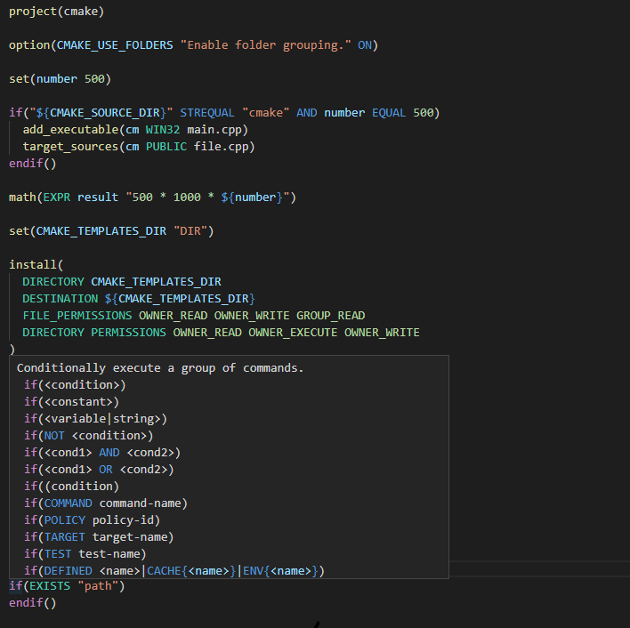

# CMake Language Support

CMake Language Support implements all of your favorite code editor features and is currently available for Visual Studio Code. An interactive preview is available at https://josetr.github.io/cmake-language-support.

Please note that we do our best to get most of the command signatures and parameters by scanning the whole CMake Documentation but it's currently impossible to be 100% accurate due to the nature of the documentation.

[](cmake-vscode.png)

## Features

- Syntax Highlighting
- Auto Completion
- Quick Info
- Signature Help
- Syntax Errors / Warnings
- Format Document
- Format Selection
- Rename Symbol
- Comment Line / Block
- Document Symbols
- Document Highlights
- Folding Ranges
- Go to Definition
- Go to References
- Find All References
- Brace Completion
- Brace Matching
- Brace Surrounding
- Smart Indentation

### Installing .NET 6 Runtime (required)

#### Automatic

[Microsoft's .NET Install Tool for Extension Authors](https://marketplace.visualstudio.com/items?itemName=ms-dotnettools.vscode-dotnet-runtime) will be used to acquire a **.NET Runtime** automagically once the extension runs for the first time. If it fails, as seems to be the case for some users, please follow the **manual** installation instructions.

#### Manual

- Install .NET Runtime
  - Windows: https://learn.microsoft.com/en-us/dotnet/core/install/windows
  - Linux: https://learn.microsoft.com/en-us/dotnet/core/install/linux
  - macOS: https://learn.microsoft.com/en-us/dotnet/core/install/macos
- Set `cmake.languageSupport.dotnetPath` to your dotnet executable path (usually `C:/Program Files/dotnet/dotnet.exe` on Windows)

### Configuration

#### Format Options

| cmake.format.[option] | false (default) | true           |
| --------------------- | --------------- | -------------- |
| spaceAfterCommandName | message()       | message ()     |
| spaceInParentheses    | message(arg)    | message( arg ) |

- allowOptionalArgumentIndentation
  ```cmake
  # false (default)       true
  message(                message(
    WARNING                 WARNING
    msg                       msg # manually added indentation will be kept
  )                       )
  ```

#### FileAPI (Experimental)

Enables experimental use of https://cmake.org/cmake/help/git-stage/manual/cmake-file-api.7.html in order to provide more accurate results.

- Install Microsoft's [CMake Tools](https://marketplace.visualstudio.com/items?itemName=ms-vscode.cmake-tools) extension
- Set `cmake.languageSupport.enableFileAPI` to `true`.

Every time `CMake Tools` configures the active cmake project (usually when you save a CMakeLists.txt file), our `cmake-file-api` query will be executed and we will be able to:

1. Provide accurate results for:

   - Targets
   - Configurations
   - Toolchains

2. Get the exact cmake files used by the cmake project and parse them all in order to:
   - Search user-declared functions, macros, and variables in all files
   - Enable the following features to work across all of the available files
     - Find All References
     - Go to Definition
     - Workspace Symbols
     - Auto Completion
     - Signature Help
     - Quick Info
